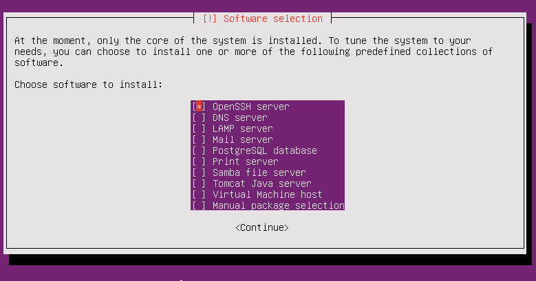
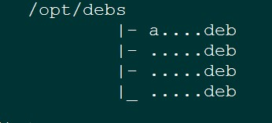

常见问题
=================================

# 如何下载Github资源？

有以下几种方法：

>* 1. 使用git工具，但务必不要使用Windows上的git tools，Windows git工具会默认自动转码，
   以致拷贝至Linux之后，出现不能解释或者运行的情况。

>* 2. https://github.com/jiyou/openstack 页面右边有Clone Zip按钮，可以点此按钮直接下载，
   再拷贝至Linux机器。

>* 3. Ubuntu节点上，运行`wget https://github.com/JiYou/openstack/archive/master.zip -o openstack.zip`。

>* 4. 也可到百度云上下载http://pan.baidu.com/s/1jG3LX58 ，极力推荐。

# 源的配置

## 方法1

由于ubuntu-12.10官方法极不稳定。为了方便使用，当安装好ubuntu-12.10之后，请照如下步骤配置源：

>* 安装openssh-server: 在利用ubuntu-12.10-server-amd64.iso安装时，请务必勾选openssh-server，如下图：

   

>* 下载github资源。

>* 解压下载的安装包。

>* cd ./openstack #就是解压后的目录，如果名字不一样，请更改目录名。

>* ./create_link.sh

>* cd ./chap10/allinone && ./create_http_repo.sh

>* 就可以正确地创建好本地可用的repo。

>* 此外，书中编译源码安装MySQL和源码编译Libvirt的部分可以跳过（实际应用场景比较少）。

## 方法2
>* 下载只含deb包的离线包：http://pan.baidu.com/s/1kTA58Q7 。

>* 解压之后形成如下目录(如果你是放在/opt/目录下解压的，你只需要检查一下就可以了)::

   

    当然，实际上你的目录结构和这个并不相符合，你会发现/opt/debs目录下有着更多的deb包。
    如果发现是这样，那么请继续下一步。

>* 修改/etc/apt/sources.list，内容如下(只保留这一行)::

    deb file:///opt/ debs/

>* 运行::

    apt-get update

>* 如果运行成功，则证明建立成功。

